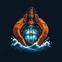
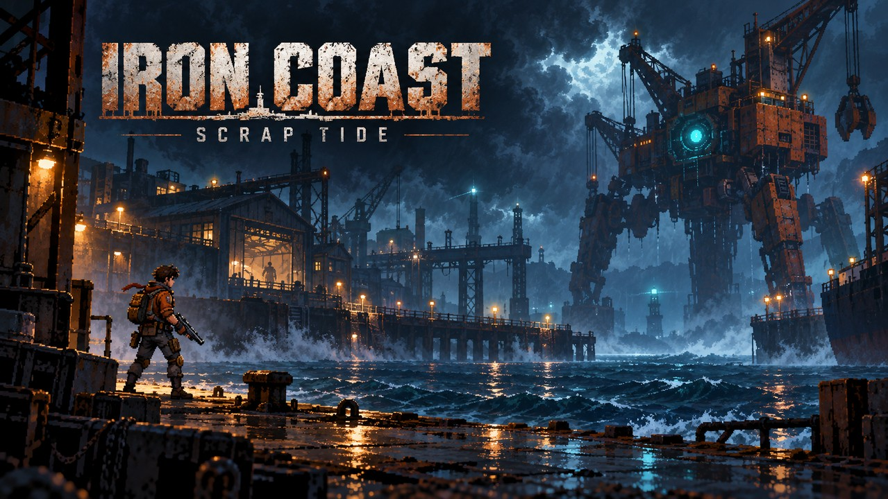
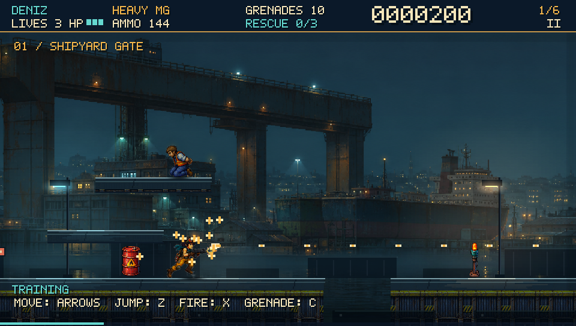
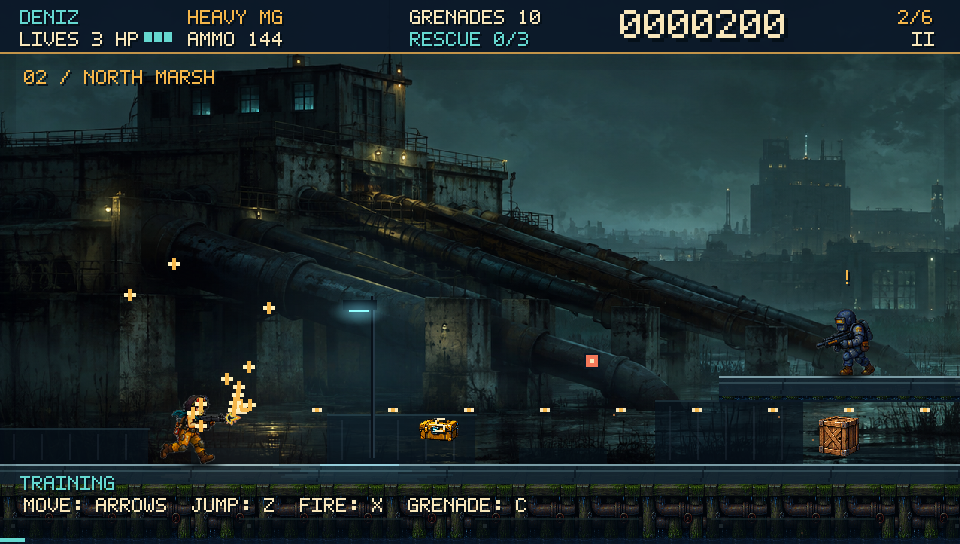
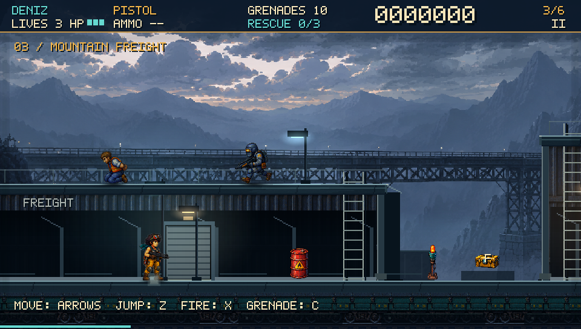
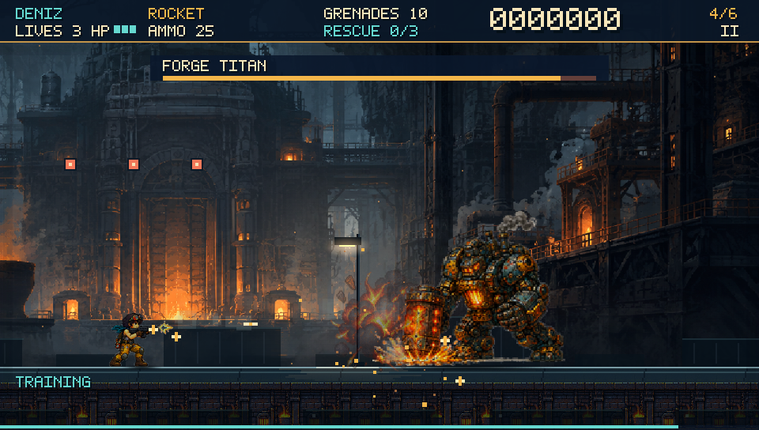
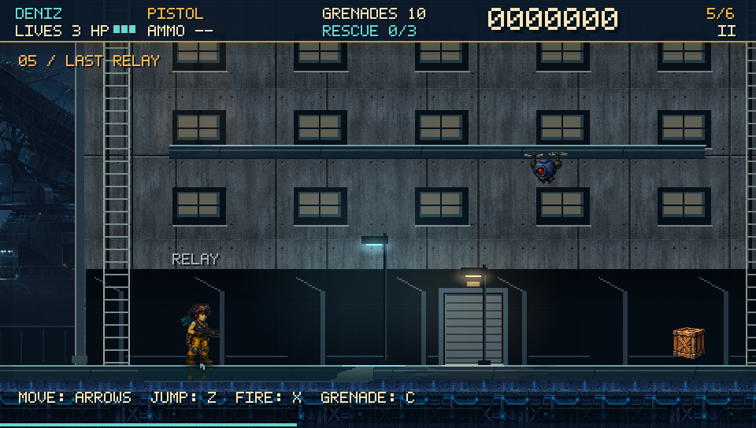
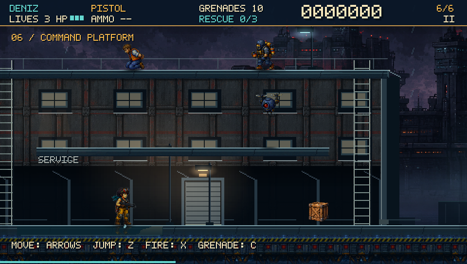

<p align="center"></p>

# Iron Coast: Scrap Tide — PS Vita

An original single-player run-and-gun homebrew for **PlayStation Vita**. Fight across six industrial coastal missions, rescue workers, commandeer the Scrap Walker and bring down the Iron Grid.

[Download VPK](https://github.com/onurkuru/ironcoast/releases/latest) · [Report a bug](https://github.com/onurkuru/ironcoast/issues)



*Original promotional artwork for the loading screen and LiveArea. Actual gameplay captures appear below.*

## Release

**v0.2.6 · PS Vita homebrew preview · Title ID `KHYI00001` · Vita app version `00.26`**

Download **`Iron-Coast-PSVita-v0.2.6.vpk`** from **Releases → Assets**. Everything needed is inside: executable, game assets, bubble icon, loading image and LiveArea. No separate asset download or commercial game data is required.

Only PS Vita game packages are distributed here. The source includes host-side development and test support, but there is no desktop game release.

**Validation:** VitaSDK cross-compilation and package checks are performed before publication. Gameplay/render tests run on the development host. Installation, LiveArea appearance, audio, controls and performance on physical Vita hardware have **not yet been verified**. This release is a development preview.

## Story

The coast once lived by its shipyards, freight lines and foundries. Now the **Iron Grid** has seized the industrial network and turned work machines into weapons.

You play **Deniz**, entering the locked shipyard to find **Efe**, who has been sabotaging the Grid from inside. **Mira** coordinates the rescue over radio. Following a trail of stolen power cores takes Deniz through poisoned marshes, an armored freight route and a failing foundry toward Captain **Sarp's** command platform.

Rescue the workers. Break the machines. Bring the coast home.

All dialogue, interface text, signage and documentation use English. Iron Coast is designed for a global audience.

## Campaign

| Mission | Setting | Boss |
|---|---|---|
| 01 — Rusted Harbor | Shipyard gate and waterfront | Claw Crane |
| 02 — Toxic Marsh | Polluted marsh and pump works | Ash Dredger |
| 03 — Ironline | Armored freight route | Black Locomotive |
| 04 — Ember Foundry | Industrial furnace complex | Forge Titan |
| 05 — Storm Relay | Storm-battered signal installation | Four Poles |
| 06 — Final Wave | Offshore command platform | Iron Grid / Sarp |

The campaign concludes after mission six. Each mission has its own dialogue, rescues, pickups and boss encounter.

## Gameplay

- Run, jump, crouch, aim upward and fire downward while airborne.
- Pistol, Heavy MG, shotgun, rockets, Flame Shot and laser pickups.
- Close-range attacks, grenades, destructible props and worker rescues.
- Pilot the Scrap Walker; manage health, ammunition and checkpoints.
- Six moving bosses with attack preparation, recovery and second-phase behavior.
- Layered industrial scenery, animated lighting, sound effects and background music.

Boss recovery now uses a teal glow on the mechanism instead of the floating `CORE OPEN` label.

## Screenshots

**Unretouched captures from the actual game renderer**, recorded on the development host at 960×544 with the same game assets as the VPK. These are not Vita hardware captures. Capture mode enables training assistance, which may be visible in the HUD.

| Rusted Harbor | Toxic Marsh |
|---|---|
|  |  |

| Ironline / Scrap Walker | Ember Foundry / Forge Titan |
|---|---|
|  |  |

| Storm Relay | Final Wave / Iron Grid |
|---|---|
|  |  |

## Installation

### Requirements

A PS Vita already configured for homebrew, working [VitaShell](https://github.com/TheOfficialFloW/VitaShell), and at least **100 MB free on `ux0:`** as installation headroom. Use USB or FTP to transfer the package. No game-specific plugin is required by this build.

This guide starts with an existing homebrew setup. For an unmodified console, consult the maintained [Vita Hacks Guide](https://vita.hacks.guide/) first.

### Download and transfer

1. Open [Releases](https://github.com/onurkuru/ironcoast/releases/latest). Download **`Iron-Coast-PSVita-v0.2.6.vpk`** under Assets. GitHub's “Source code” archives are for developers, not installation.
2. Optionally download `SHA256SUMS.txt` and compare the VPK's SHA-256 hash with the published value.
3. Open VitaShell. Press **START**, set the **SELECT button** action to **USB**, and choose the USB storage device that corresponds to your active `ux0:` storage.
4. Connect a data-capable USB cable and press **SELECT** to begin transfer. On the mounted storage, create a `VPK` folder if needed and copy the file into it. It will appear as `ux0:VPK/` on the Vita.
5. Safely eject the storage on the computer, then leave USB mode on the Vita.

**FTP alternative:** set VitaShell's SELECT action to FTP. Press SELECT and enter the address and port shown by your Vita into an FTP client on the same network. Upload to `ux0:VPK/` and end the transfer. Both transfer modes are provided by [VitaShell](https://github.com/TheOfficialFloW/VitaShell).

### Install and launch

1. In VitaShell, navigate to `ux0:VPK/` and select the downloaded `.vpk`.
2. Press VitaShell's confirm button and confirm installation. Confirm is usually **Cross**, but can depend on system/VitaShell settings.
3. Wait until installation completes. Return to LiveArea and open **Iron Coast: Scrap Tide**, identified by the orange claw and cyan core icon.
4. Select **Start**. After successful installation, the copied VPK in `ux0:VPK/` can be deleted to reclaim space.

### Updates and saves

Close the game and back up **`ux0:data/KiyiHurdasi/save.dat`** before updating. Install the newer VPK with the same Title ID over the existing application; uninstalling the old bubble is unnecessary.

The save holds campaign progress and settings, not a snapshot of the current fight. Checkpoints work during a run. The internal save-folder name is retained for compatibility.

## Vita controls

| Input | Action |
|---|---|
| D-pad / left stick | Move; aim up or crouch/aim down |
| Cross | Jump / menu confirm |
| Square | Fire; close-range attack when an infantry enemy is in reach |
| Circle or R | Grenade |
| Triangle | Enter / exit available vehicle |
| START | Pause / resume |
| Circle in menus | Back |

Hold **Up + Square** to shoot upward. Use **Down + Square while airborne** to shoot downward. Game controls are fixed as listed, independently of VitaShell's confirm-button setting.

## Troubleshooting

| Problem | Check |
|---|---|
| VPK not visible | Copy the `.vpk`, not a source archive, to the storage mounted as `ux0:`. |
| Transfer fails | Check VitaShell's USB/FTP mode, cable, selected storage or local network. |
| Installation error | Check free space, download again and compare SHA-256. Report the exact error code. |
| Game does not launch | Confirm homebrew is active and installation finished. Report model, firmware and release version. |
| Old icon remains | Close the app and restart the Vita before checking again. Do not delete saves to refresh artwork. |
| Lost progress | Check the backup of `ux0:data/KiyiHurdasi/save.dat`; report old and new versions. |
| Slowdown, audio or input issue | Report the mission, location, Vita model and reproduction steps. Hardware tuning is still pending. |

[Open an issue](https://github.com/onurkuru/ironcoast/issues) with the release number and a screenshot/video if possible.

## Development status

v0.2.6 completes the English-only presentation and documentation pass. It retains the v0.2.5 fixes for rescue progress after death/Continue, along with full-campaign, restart, randomized-input and whole-map rendering checks. See the [stability audit](docs/STABILITY_AUDIT.md) for results, reproduction commands and limits.

The current six-mission campaign and boss improvements are included. The building-led redesign in [LEVEL_DESIGN_RESEARCH.md](LEVEL_DESIGN_RESEARCH.md) is **planned work, not part of v0.2.6**. Promotional art does not represent new playable buildings or the in-game boss scale.

Technical notes: [sprite audit](SPRITE_AUDIT.md), [art direction](ART_DIRECTION.md), [level research](LEVEL_DESIGN_RESEARCH.md).

## Build for Vita

Install [VitaSDK](https://vitasdk.org/) with SDL2, CMake and a build tool. Set `VITASDK` and add its `bin` directory to PATH according to the SDK instructions.

```sh
cmake -S . -B build-vita -DKH_VITA=ON -DCMAKE_BUILD_TYPE=Release
cmake --build build-vita -j4
python3 tools/validate_vpk.py build-vita/kiyi-hurdasi.vpk
```

Output: `build-vita/kiyi-hurdasi.vpk`. The validator needs only Python's standard library. LiveArea images are committed; Pillow is needed only to regenerate them using `tools/prepare_livearea.py`.

Host-side QA uses `-DKH_VITA=OFF` with SDL2/pkg-config; it is not a distributed game package.

## Credits

Original Iron Coast world, characters and assets. The new icon and cover use built-in image generation; see [prompts and provenance](docs/art/PROVENANCE.md). Runtime technology: SDL2, VitaSDK and stb. Third-party notices accompany the package in `licenses/`.

Independent homebrew; not an official PlayStation release. No Metal Slug or REPLACED sprites are included.
