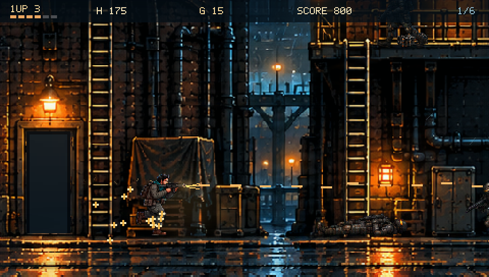

# Arcade gameplay pass

This pass prioritizes the playable six-mission campaign. The cinematic art target remains ongoing; Vita-specific optimization is deferred until gameplay review.

## Player-visible changes

- Run speed 145 → 205 and climb speed 72 → 130 world units/second. Acceleration and camera response support the faster pace without changing the established jump-height geometry.
- Campaign weapons cycle magazines without a forced pause. Powered ammo remains finite, pistol ammo is unlimited, and optional manual reload still exists.
- Infantry share adult proportions. Grenadiers launch from their authored muzzle, shields lower during firing, and turning behind a committed shield exposes its back.
- Five-person door squads, extra supported roof guards and early/post-door weapon caches create sustained, finite encounters.
- Ordinary bullet hits do not freeze movement. Forward-only melee, nearest swept impact and physically oriented grenade bounce remove concrete combat errors.
- Health, lives, reserve ammo, grenades, score and boss health are visible. Hostile rounds and grenade fuses have separate readable cues.
- Rescues restore one missing health point plus the existing two grenades. Used workers remain used after checkpoint retry.

## Reproduce gameplay

Build the host target, then run `kiyi_hurdasi --stage 1 --arcade-review --frames 4200` from the repository root. This controller uses ordinary movement, firing, grenades, crouch and vehicle interaction; it waits for actual door squads and fights them. It uses normal damage. `--arcade-review-assist` is a separately named invulnerable capture mode. The older traversal demo now continues walking after a boss dies.

The controller never teleports actors, restores health or injects damage. Its perfect access to current game state still makes it an automated regression instrument, not a human enjoyment or difficulty verdict.

## Verification

Final integrated test and normal-damage results are appended after the team handoff. Physical Vita performance and REPLACED-equivalent art quality are not certified by host tests.

### Normal-damage controller results

| Mission | Time | Outcome |
|---|---:|---|
| Harbor | 27.7 s | Clear, 3 lives / 1 HP |
| Marsh | 34.8 s | Clear, 2 lives / 3 HP |
| Ironline | 47.7 s | Clear, 1 life / 3 HP |
| Foundry | 44.7 s | Clear, 1 life / 1 HP |
| Relay | 54.2 s | Clear, 2 lives / 4 HP |
| Final Wave | 57.1 s | Clear, 1 life / 2 HP |

Each route engages 13–20 enemies. All six normal-damage and all six assisted routes clear; the two modes are reported separately. The test now requires all six normal-damage clears. Relay’s former failure came from the controller skipping elevated drone/roof threats before entering the arena; it now aligns for ordinary upward fire and clears those threats. Boss stats and attack strength were not reduced. Human pacing, difficulty and enjoyment still require playtesting.

### Integrated checks

All 26 host CTest cases pass, including six-stage progression, continuous routes, new combat/controller regressions and texture-state restoration. All 13 full-application SDL/audio/menu/malformed-save startup checks pass.

The frame above is captured from the executable during the ordinary-damage Harbor review. The local review includes its complete 30-second recording with game audio.

### Fair cover and accurate warnings

Physical crates and barrels now intercept hostile fire as well as player shots. A regression checks both a player sheltered behind a crate and a player exposed in front of it. Foundry windup warnings distinguish falling columns from horizontal volleys and follow their actual positions.

### Sequential normal-damage campaign

The acceptance controller also runs `beginChapter(chapter, chapter>0)` across all six chapters and both opening rooms, calls the real `advanceSection()`, and uses the normal `retry()` only after Game Over. Lives carry between missions. All six chapters clear in 21,407 simulation frames (356.8 seconds), with 10 life losses and 3 Continues (Ironline, Relay, Final Wave); ending state is 2 lives / 2 HP. This is explicitly a continued campaign, not a no-continue clear. The test caps Continues at 12 and retains the separate six fresh-mission clear requirements.

The fair-encounter continuation passed the complete 26-test host suite and all 13 SDL/audio/menu/save startup cases in the new active checkout. The 60-second Relay recording shows normal damage, actual game audio and the Mission Complete screen.
