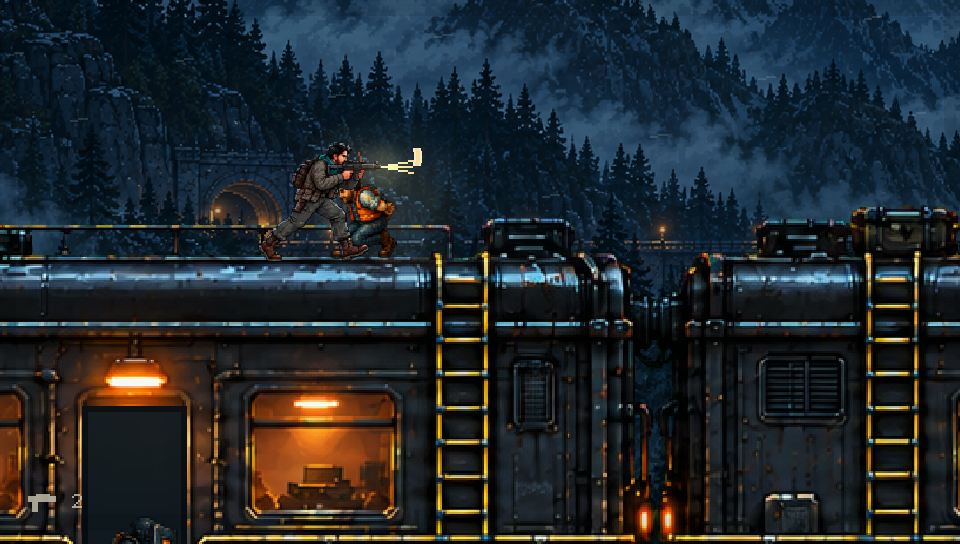
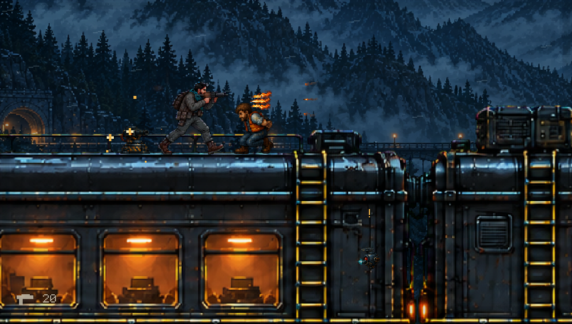
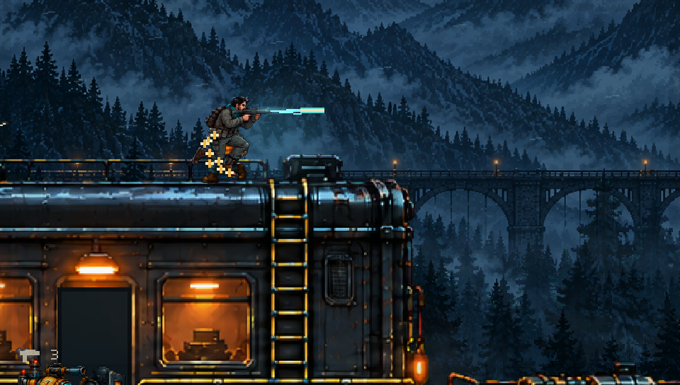

# Ironline campaign integration

Mission 03 now uses a registered foreground train rather than the earlier
platform kit. Three carriage roofs connect to a continuous lower service deck
through six painted ladders. Two authored door panels open for finite guard
pairs. Three workers and weapon pickups occupy the roof route. The separate
two-carriage [review slice](IRONLINE_REVIEW.md) is preserved.

## Art and movement

`assets/ironline-integrated-v2.png` supplies the train architecture. Its normalized
roof, ladder, door and floor coordinates live in `data/presentation.json`.
The foreground stays in the same reference frame as the player and collision.
Mountains move at 5.5% of travel and forest at 48%, including separate vertical
depth responses during climbing. Low fog and restrained wind use scene time.
Repeated mirrored scenery panels maintain edge continuity; the vista is not an
unbounded unique world.

The cool forest was reduced in intensity after inspecting actual gameplay, with
a weak cool light on exposed roof actors and warm practical window/door lights.
The quality benchmark remains [REPLACED](../pixel-art/QUALITY_TARGET.md), not a
claim of equivalent animation, lighting technology or production value.

Both generation prompts and provenance are in `pixel-art/ironline-integrated/`.
The first generated image had a painted checkerboard instead of usable alpha;
it was rejected. The accepted correction uses an opaque green matte that is
removed once by the engine's existing import rule, with edge despill. The source
PNG is unchanged. No REPLACED image is included in the game.

## Continuous campaign review

`--ironline-campaign-review` uses ordinary move, fire and climb inputs after its
initial spawn. It traverses all three roofs and six ladders, rescues three workers
and triggers both doors in **1,609 simulation frames (26.82 seconds)**. It returns
to the lower deck before the boss arena. Training invulnerability is enabled;
enemies stay in the scene. The route is not a combat-balance benchmark.

```sh
cmake -S . -B build-qa -DKH_VITA=OFF -DCMAKE_BUILD_TYPE=Release
cmake --build build-qa -j4
ctest --test-dir build-qa --output-on-failure
build-qa/kiyi_hurdasi --assets assets --ironline-campaign-review
```

Use `--stage 3` for normal campaign play. `--ironline-review` still opens the
separate short slice. For a 30-second capture, create `build-qa/ironline-frames`:

```sh
SDL_VIDEODRIVER=dummy SDL_AUDIODRIVER=dummy build-qa/kiyi_hurdasi \
  --assets assets --ironline-campaign-review --fast --frames 1800 \
  --record build-qa/ironline-frames --record-every 2 \
  --record-audio build-qa/ironline-audio.s16le
```

The frame sequence is 30 fps at 960×544. Audio is mono signed 16-bit little-endian
PCM at 32 kHz and contains the game's existing sounds, not a new train soundscape.
Offline recording speed does not measure real-time hardware performance.

## Keeping architecture synchronized

After editing the measured anchors:

```sh
python3 tools/ironline_architecture.py
python3 tools/compile_campaign.py
python3 tools/compile_presentation.py
```

Registration checks cover each integrated scene and full architecture
regeneration. The full generator's indentation regression was corrected; its
test now exercises imports and verifies that regeneration preserves all three
integrated maps. The roof-route test follows each roof's actual ladder pair
instead of assuming the old kit's fixed 26-unit inset.

Render checks cover green-key leakage, landscape motion while idle, fixed train
contact, vertical climb translation, deterministic replay and scene reloads.
All 24 host tests passed. Vita cross-compilation and package validation passed
with title `KHYI00001`, version `00.40` and 77 resources. Physical Vita testing
remains pending.

| First carriage | Middle carriage | Third carriage |
|---|---|---|
|  |  |  |

These are unedited executable frames at 5.33, 14.33 and 23.67 seconds of the
30-second recording. Ascent, descent and the final lower-deck contact were also
inspected. The frame sequence contains normal combat and the actual moving vista.

## Remaining work

The foreground is a painted layer. Bogies and windows are not independently
animated, and there is no new carriage interior or train-specific ambient audio.
The short recording does not establish boss balance or full mission completion.
The remaining three campaign maps need their own integrated architecture pass;
animation polish and the visual quality target remain broader project work.
