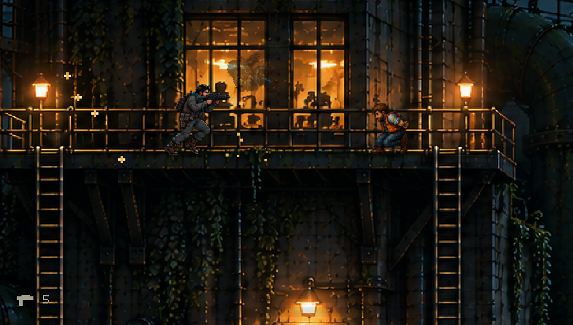
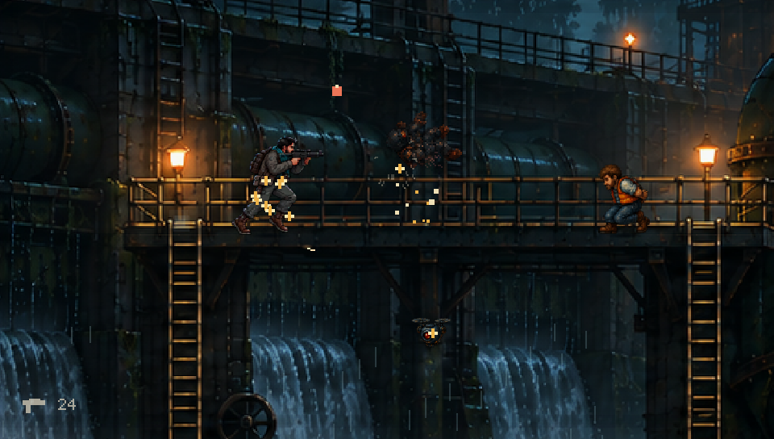
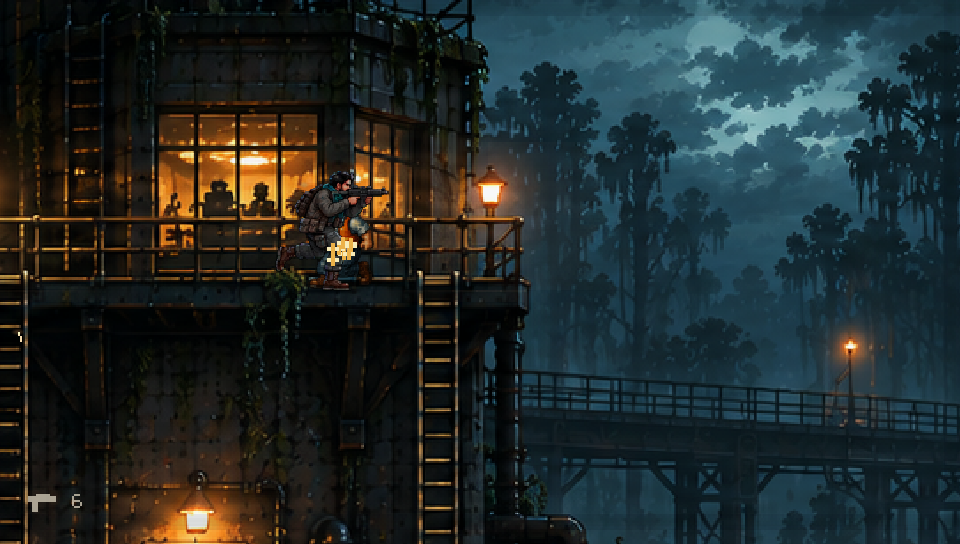

# Marsh pump-station integration

Toxic Marsh uses `assets/marsh-integrated-v3.png` as its painted architecture.
Three galleries, six ladders and two reinforcement doors share measured anchors
in `data/presentation.json`. `tools/marsh_architecture.py` derives the collision,
guard, rescue and pickup placement from those anchors. The route is 1,920 world
units wide, matching Harbor's actor-to-environment scale.

The first painting established the pump-station layout; a second image-generation
pass reduced uniformly bright texture and concentrated contrast around practical
lamps and windows. The user's REPLACED reference guides the
[quality target](../pixel-art/QUALITY_TARGET.md). It is not included as a game
asset. Generation prompts are preserved in `pixel-art/marsh-integrated/`.

## Motion and interaction

- The original painting supplies rails, brackets, ladders and door surrounds.
  The renderer slides only the measured door panels when guards emerge.
- Three bounded water flows animate inside the spillways, behind the actors.
  Low drifting mist stays below the walking contact plane.
- Three timed pressure vents occupy the lower service lane, clear of ladder
  landings. Shallow metal grilles replace the old flat green hazard strips;
  steam stays within the damaging height. The galleries contain guards,
  weapon pickups and three workers.
- The same continuous input controller reviews Harbor and Marsh. After the
  initial spawn it uses ordinary move, fire and climb inputs; no teleporting
  or enemy removal occurs. Training invulnerability is enabled.

`--marsh-review` finishes all three galleries in **1,811 simulation frames
(30.18 seconds)**, traverses all six ladders, rescues three workers, triggers
both doors and returns to the lower lane before the boss arena. Automated checks
reject camera snaps, incomplete traversal and mismatched painting/collision data.

```sh
cmake -S . -B build-qa -DKH_VITA=OFF -DCMAKE_BUILD_TYPE=Release
cmake --build build-qa -j4
ctest --test-dir build-qa --output-on-failure
build-qa/kiyi_hurdasi --assets assets --marsh-review
```

Use `--stage 2` for normal controls. For a 32-second review capture, create
`build-qa/marsh-frames` and run:

```sh
SDL_VIDEODRIVER=dummy SDL_AUDIODRIVER=dummy build-qa/kiyi_hurdasi \
  --assets assets --marsh-review --fast --frames 1920 \
  --record build-qa/marsh-frames --record-every 2 \
  --record-audio build-qa/marsh-audio.s16le
```

Frames are 960×544 at 30 fps; audio is mono signed 16-bit little-endian PCM at
32 kHz. This deterministic host capture does not measure physical Vita speed.

After editing anchors, regenerate with:

```sh
python3 tools/marsh_architecture.py
python3 tools/compile_campaign.py
python3 tools/compile_presentation.py
```

## Review scope

All 21 host CTest checks passed, including both continuous gallery routes.
Visual inspection covers gallery contacts, ladder transitions, door openings,
water placement and actor readability through the route. Vita cross-compilation
and package validation also passed: title `KHYI00001`, version `00.40`, 76
resources. The screenshots below are unedited executable frames at 5.33, 16 and
26.33 seconds of the 32-second recording.

| West pump hall | Spillway gallery | East control room |
|---|---|---|
|  |  |  |

This is a painted 2D environment with limited perspective and local lighting.
Background silhouettes are part of the painting. The scene does not yet provide
independently animated background machinery, a full depth-lit environment or
REPLACED-equivalent animation. The remaining four missions still need comparable
architecture integration. Hardware performance and combat balance remain outside
this invulnerable route review; no new public release is implied.
